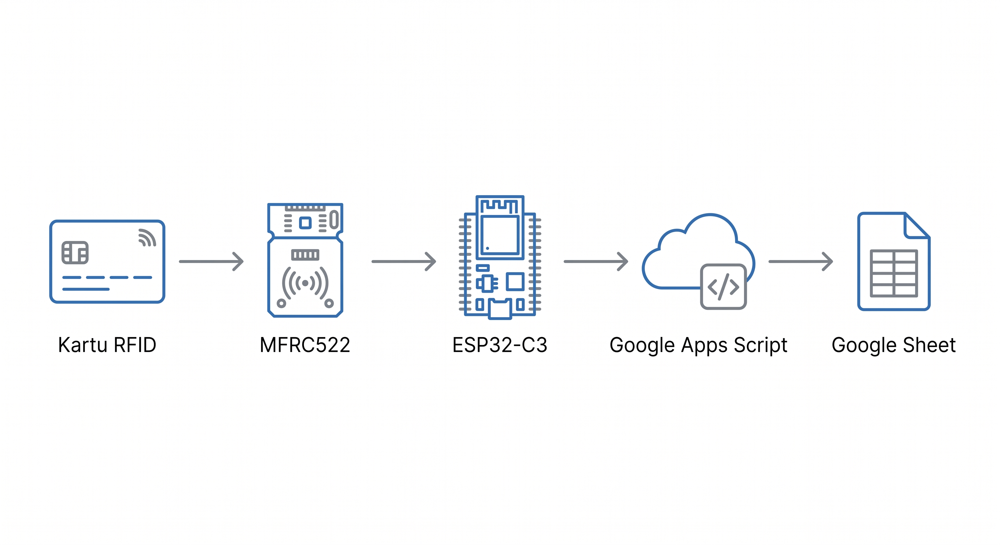

# Sistem Logbook Pengunjung Lab berbasis RFID

Rancangan sistem pencatatan kunjungan lab, dari surat izin sampai pengunjung tinggal tap
kartu RFID di pintu masuk.

## Latar Belakang

Pencatatan pengunjung lab saat ini masih manual, memakai Google Form untuk mencatat siapa
yang masuk, kapan, dan untuk keperluan apa. Sistem ini mengotomatiskan bagian
pencatatan kehadiran saja — pengunjung yang sudah terdaftar tinggal tap kartu RFID di
pintu masuk. Proses administratif seperti surat izin tetap berjalan manual seperti biasa.

## Cara Kerja

```
1. Pengunjung mengajukan surat izin kunjungan ke lab/kampus (di luar sistem ini).
2. Admin lab menyetujui surat izin.
3. Admin mendaftarkan pengunjung ke Google Sheet: nama, institusi, tujuan, dan UID
   kartu RFID.
4. Pengunjung tap kartu RFID di reader saat masuk lab.
5. Reader mencocokkan UID ke data terdaftar dan mencatat waktu tap sebagai log kunjungan.
```

Langkah 1–3 adalah pendaftaran, dilakukan sekali per pengunjung. Langkah 4–5 berulang
setiap kali pengunjung datang. Satu tap mencatat satu kunjungan — tidak ada tap keluar,
jadi sistem ini mencatat kehadiran saja, tanpa menghitung durasi kunjungan.

## Arsitektur



- **MFRC522** membaca UID kartu lewat SPI.
- **ESP32-C3 SuperMini** membaca UID dari MFRC522, terhubung ke WiFi UGM-IoT (WPA2-PSK),
  dan mengirim UID ke Apps Script lewat HTTPS setiap ada tap.
- **Google Apps Script** menerima UID, mencocokkannya ke Sheet `Pengunjung`, mencatat ke
  Sheet `Log_Kunjungan` kalau valid, dan membalas status ke ESP32.
- **Google Sheet** menyimpan dua tab: `Pengunjung` untuk data hasil pendaftaran, dan
  `Log_Kunjungan` untuk riwayat tap. Admin melihat dan mengedit data langsung lewat Sheet,
  tanpa halaman admin terpisah.

Sistem awalnya memakai server sendiri (Flask + SQLite) yang jalan di komputer lab. Server
itu diganti Google Sheets dan Apps Script karena dua alasan: komputer lab pakai Ethernet
sedangkan device pakai WiFi, jadi keduanya sulit disatukan dalam satu jaringan; dan Apps
Script Web App punya URL tetap yang bisa diakses dari jaringan mana pun asal ada internet,
tanpa perlu komputer yang menyala terus-menerus.

## Skema Data

**Tab `Pengunjung`** — satu baris per pengunjung terdaftar.

| Kolom | Keterangan |
|---|---|
| `uid_kartu` | UID kartu RFID pengunjung |
| `nama` | Nama pengunjung |
| `institusi` | Asal institusi/kampus/perusahaan |
| `tujuan` | Keperluan kunjungan |
| `tanggal_daftar` | Tanggal pendaftaran |
| `status` | `aktif` atau `nonaktif` |

**Tab `Log_Kunjungan`** — satu baris per tap kartu.

| Kolom | Keterangan |
|---|---|
| `uid_kartu` | Merujuk ke `Pengunjung.uid_kartu` |
| `nama` | Disalin dari `Pengunjung` saat tap terjadi |
| `tujuan` | Disalin dari `Pengunjung` saat tap terjadi |
| `waktu_tap` | Waktu tap |

Nama dan tujuan disalin ke `Log_Kunjungan` (bukan sekadar dirujuk lewat UID) supaya riwayat
langsung terbaca tanpa perlu membuka tab lain, dan tetap merekam kondisi pengunjung saat
tap terjadi meskipun datanya di `Pengunjung` diedit belakangan.

## Pemilihan Mikrokontroler

WiFi lab tersedia dalam dua bentuk: eduroam (WPA2-Enterprise) dan captive portal. Keduanya
tidak didukung modul WiFi murah seperti ESP-01, jadi rancangan awal (STM32 + ESP-01
terpisah) diganti satu chip WiFi-mikon yang bisa menjalankan autentikasi sendiri. Proses
mencari chip yang benar-benar berhasil connect ke eduroam butuh empat percobaan board:

| Board | Hasil |
|---|---|
| Wemos D1 Mini (ESP8266) | Build berhasil, tapi gagal konsisten connect eduroam meski kredensial terbukti benar (berhasil di Windows). SDK WPA2-Enterprise ESP8266 hanya mendukung TLS 1.0 — kemungkinan sudah dinonaktifkan di RADIUS server eduroam kampus. |
| ESP32-C3 SuperMini | Dukungan WPA2-Enterprise lebih matang (PEAP-MSCHAPv2 didukung), tapi board brownout berulang saat WiFi transmit — regulator daya bawaan tidak cukup kuat untuk lonjakan arus hingga 500mA. |
| ESP32 WROOM | Regulator lebih baik, brownout hilang. Eduroam tetap gagal, dengan kode alasan yang berbeda-beda tiap percobaan (`BEACON_TIMEOUT`, `ASSOC_FAIL`, `HANDSHAKE_TIMEOUT`, `AUTH_EXPIRE`), termasuk ke access point fisik yang berbeda. Laporan serupa ada di [issue #5027 arduino-esp32](https://github.com/espressif/arduino-esp32/issues/5027): berhasil lewat ESP-IDF murni, gagal lewat Arduino core. |
| ESP32-C3 SuperMini (dipakai kembali) | Eduroam ditinggalkan, WiFi pindah ke WPA2-PSK (UGM-IoT) yang tidak punya masalah stabilitas serupa di board manapun. Brownout sebelumnya murni soal power supply saat pengujian, bukan cacat chip — dipakai lagi dengan power supply yang memadai. |

Mikon final: **ESP32-C3 SuperMini**, WiFi WPA2-PSK ke UGM-IoT.

## Status dan Rencana Kerja

Sistem tap-in sudah berjalan penuh dari kartu fisik sampai tercatat di Sheet.

| Hari | Pekerjaan | Status |
|---|---|---|
| 1 | Google Sheet + Apps Script (endpoint `doPost`, deploy Web App) | Selesai — [detail](../Tutorial/Hari-1-Setup-Sheet-AppsScript.md) |
| 2 | Form pendaftaran pengunjung | Dilewati — admin mendaftarkan pengunjung langsung ke Sheet |
| 3 | ESP32 connect WiFi + HTTPS ke Apps Script | Selesai — [detail](../Tutorial/Hari-3-WiFi-HTTPS-AppsScript.md) |
| 4 | Integrasi pembaca RFID | Selesai — [detail](../Tutorial/Hari-4-Integrasi-RFID.md) |
| 5 | Uji kasus tidak biasa, dokumentasi akhir | Belum mulai |

Beberapa kendala teknis khusus ESP32-C3 SuperMini ditemukan dan diperbaiki selama Hari 3–4
(Serial Monitor tidak menampilkan output, bug redirect di HTTPClient, duplikat request dari
Google, USB yang perlu dicabut-pasang ulang setelah upload) — detail lengkap tiap kendala
ada di Tutorial masing-masing hari.

Yang masih tersisa:

- Persetujuan akses WiFi UGM-IoT dari departemen. Sistem sudah tervalidasi lewat hotspot
  HP sementara, jadi ini tidak menghambat pengembangan, tapi perlu selesai sebelum
  pemasangan permanen di lab.
- Uji kasus tidak biasa: kartu tidak terdaftar, koneksi WiFi putus sesaat.
