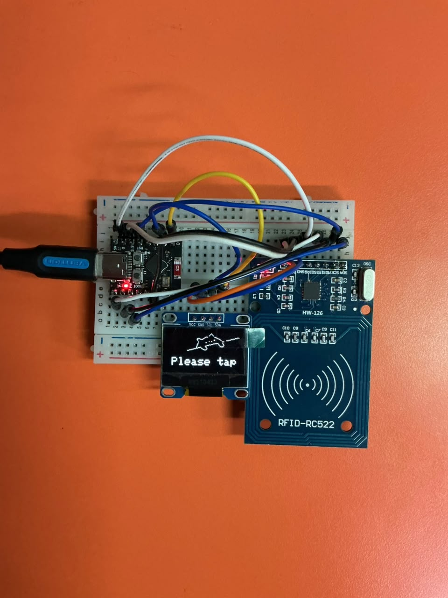

# Sistem Logbook Pengunjung Lab berbasis RFID

Sistem pencatatan kunjungan otomatis untuk Laboratorium Power Electronics. Pengunjung yang
sudah terdaftar tinggal tap kartu RFID di pintu masuk, tanpa perlu isi buku tamu fisik.

## Cara kerja

1. Pengunjung mengajukan surat izin kunjungan ke lab, lalu admin mendaftarkan namanya ke
   Google Sheet bersama UID kartu RFID yang akan dipakai.
2. Saat berkunjung, pengunjung tap kartu di reader RFID yang terpasang di pintu masuk.
3. ESP32 membaca UID kartu dan mengirimkannya ke Google Apps Script lewat HTTPS.
4. Apps Script mencocokkan UID ke daftar pengunjung terdaftar, lalu mencatat waktu tap ke
   Google Sheet.
5. Layar pada perangkat menyapa pengunjung dengan namanya, atau memberi tahu bahwa kartunya
   belum terdaftar.

Rincian tiap langkah ada di bagian [Cara Kerja](Dokumen/Sistem-Logbook-Pengunjung-RFID.md#cara-kerja)
di dokumen utama.

## Arsitektur

ESP32 membaca UID kartu lewat modul MFRC522, connect ke jaringan WiFi kampus, lalu
mengirim data tap ke Google Apps Script yang mencocokkan dan mencatatnya ke Google Sheet.
Hasilnya ditampilkan di layar OLED pada perangkat, sehingga alat ini berdiri sendiri di
pintu masuk tanpa komputer yang tersambung.

Detail lengkap arsitektur, varian ESP32 yang dipakai, keputusan teknis, dan skema data ada
di [Dokumen/Sistem-Logbook-Pengunjung-RFID](Dokumen/Sistem-Logbook-Pengunjung-RFID.md).

## Struktur folder

- [Dokumen/](Dokumen/) — rancangan sistem, keputusan arsitektur, dan milestone pengerjaan.
- [Tutorial/](Tutorial/) — panduan langkah kerja per milestone, urut sesuai hari pengerjaan.
- [Referensi/](Referensi/) — materi pendukung (modul praktikum IoT, datasheet, gambar pinout).
- [logbook-firmware/](logbook-firmware/) — kode firmware ESP32 (PlatformIO, framework Arduino).
- [logbook-appsscript/](logbook-appsscript/) — salinan lokal kode Google Apps Script (backend
  yang jalan di Google, dipakai untuk riwayat/backup di luar Apps Script Editor).

## Status pengerjaan

Status terkini ada di bagian [Status dan Rencana Kerja](Dokumen/Sistem-Logbook-Pengunjung-RFID.md#status-dan-rencana-kerja)
di dokumen utama.
